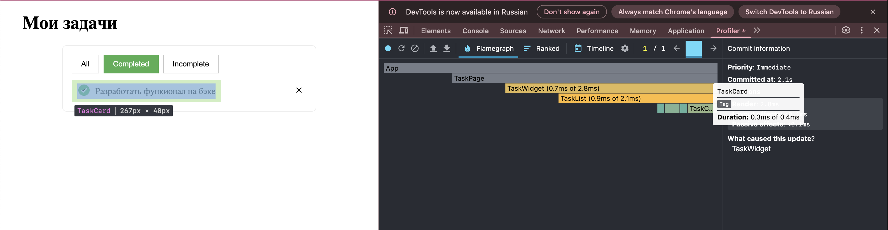
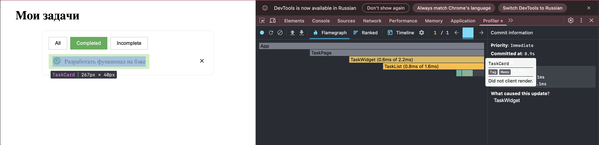
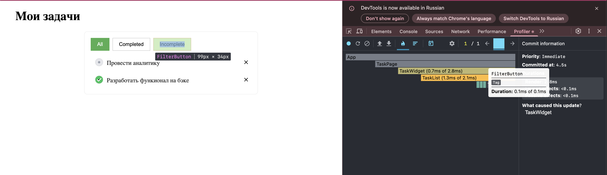
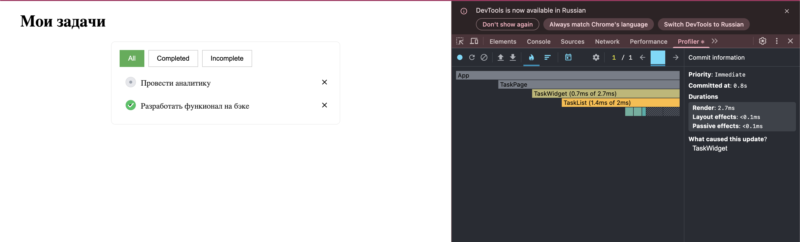
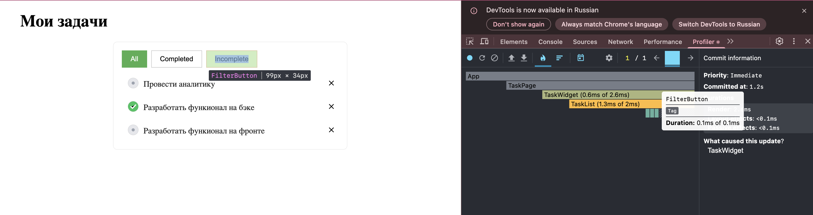

1. Сценарий: фильтрация с одинаковым результатом в задачах (один результат и переключение фильтра с All на Completed)

До использования React.memo в компоненте TaskCard был в ререндер компонента TaskCard

После использования React.memo в компоненте TaskCard ререндера компонента TaskCard больше не происходит

2. Сценарий: удаление одного резульата без изменения фильтра

Каждый раз происходит ререндер всех трех FilterButton

3. Сценарий: удаление одного резульата без изменения фильтра

До использования useCallback в функции removeTask время перерендера компонента TaskList было больше чем после ее применения (у меня кнопка с функцией removeTask для каждой задачи прописана в компоненте TaskList)

